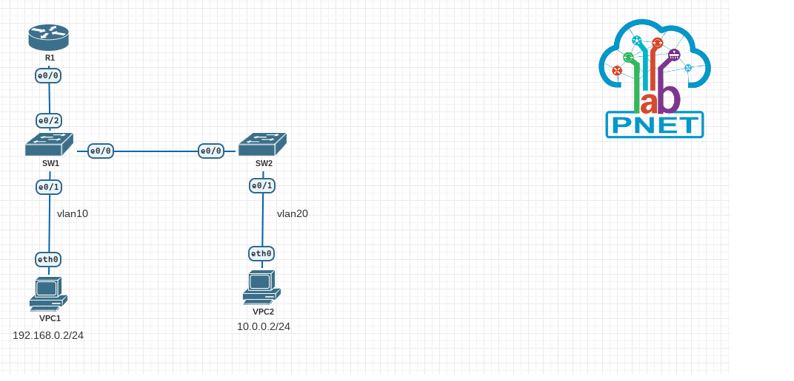

# otus part 1 lesson 3
## Цель задания
1. Создать в эмуляторе сеть и сделать базовые настройки
2. Создать на switch vlan-ы и назначить vlan на порты
3. Сконфигурировать транковое соединение между свичами
4. Настроить маршрутизацию пакетов между vlan на роутере
5. Проверить на лабораторном стенде работоспособность конфигурации
## Схема лабораторонй работы

## Конфигурационный файл лабораторной работы (eve-ng)
[otuslesson3vlan.unl](otuslesson3vlan.unl)
## Таблица vlan
vlan | name | interface assigned
-----|------|-------------------
10 | vlan10 | sw1: e0/1 untagged
   |       | | sw1: e0/2 tagged
20 | vlan20 | sw1: e0/0, e0/2 tagged
   |       | | sw2: e0/0 tagged
   |       | | sw2: e0/1 untagged
## Таблица адресов
Device | Interface | IP Address | Subnet Mask | Default Gateway
-------|-----------|------------|-------------|----------------
r1 | e0/0.1 (vlan10) | 192.168.0.1 | 24      | none
  | | e0/0.2 (vlan20) | 10.0.0.1 | 24      | none
VPC1 | eth0 (vlan10) | 192.168.0.2 | 24      | 192.168.0.1
VPC2 | eth0 (vlan20) | 10.0.0.2 | 24      | 10.0.0.1
## Вывод консоли VPC2

```VPCS> show

NAME   IP/MASK              GATEWAY                             GATEWAY
VPCS1  10.0.0.2/24          10.0.0.1
       fe80::250:79ff:fe66:680d/64

VPCS> ping 192.168.0.2

84 bytes from 192.168.0.2 icmp_seq=1 ttl=63 time=1.882 ms
84 bytes from 192.168.0.2 icmp_seq=2 ttl=63 time=1.934 ms
84 bytes from 192.168.0.2 icmp_seq=3 ttl=63 time=1.991 ms
84 bytes from 192.168.0.2 icmp_seq=4 ttl=63 time=1.867 ms
84 bytes from 192.168.0.2 icmp_seq=5 ttl=63 time=2.061 ms

VPCS>
```